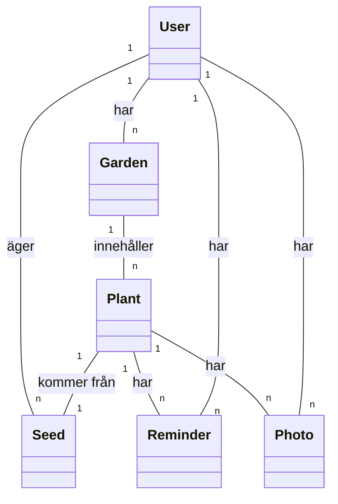
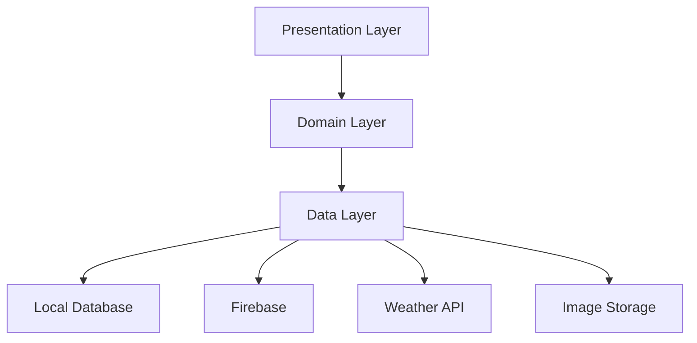

# PlantSeeds - Översikt

## Syfte och Mål
PlantSeeds är en applikation för trädgårdsentusiaster som vill:
- Hantera sin frösamling
- Spåra växternas tillväxt
- Få påminnelser om vattning och skötsel
- Dela erfarenheter med andra användare

## Huvudfunktioner
1. **Fröhantering**
   - Katalogisera frön
   - Spåra fröers livslängd
   - Plantera frön
   - Dela frön med andra användare

2. **Växthantering**
   - Spåra växternas tillväxt
   - Logga skötselåtgärder
   - Ta och dela bilder
   - Få skötselråd

3. **Trädgårdsplanering**
   - Skapa virtuella trädgårdar
   - Plantera växter
   - Få väderbaserade rekommendationer
   - Dela trädgårdsdesigner

4. **Sociala Funktioner**
   - Dela erfarenheter
   - Följa andra användare
   - Byta frön
   - Skapa gemenskaper

## Tekniska Krav
1. **Plattformar**
   - Android (min SDK 24)
   - iOS (kommande)
   - Web (kommande)

2. **Prestanda**
   - Snabb app-start (< 2 sekunder)
   - Responsivt gränssnitt
   - Effektiv bildhantering
   - Optimerad databasanvändning

3. **Offline-funktionalitet**
   - Full funktionalitet offline
   - Automatisk synkronisering när online
   - Konfliktlösning vid synkronisering

4. **Säkerhet**
   - Användarautentisering
   - Datakryptering
   - Säker bildhantering
   - GDPR-efterlevnad

## Datamodell

## Systemarkitektur

## Nästa Steg
1. Läs [Miljöinställningar](01_Environment_Setup.md)
2. Följ [Projektkonfiguration](02_Project_Setup.md)
3. Granska [Arkitekturprinciper](../01_Architecture/01_Clean_Architecture.md) 