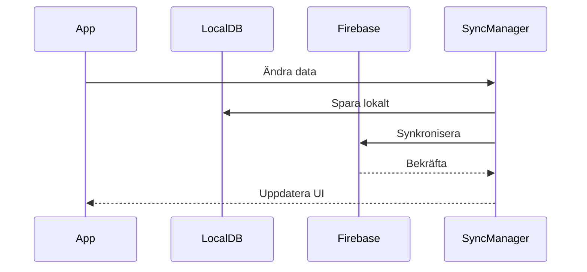

# Synkronisering

Här dokumenteras synkroniseringslogiken mellan lokal databas och Firebase.

## Innehåll
- [Sync Strategy](SyncStrategy.md) - Synkroniseringsstrategi
- [Conflict Resolution](ConflictResolution.md) - Konfliktlösning
- [Offline Support](OfflineSupport.md) - Offline-stöd
- [Background Sync](BackgroundSync.md) - Bakgrundssynkronisering

## Synkroniseringsflöde


## Offline-first Strategi
1. **Lokal Lagring**
   - Alla ändringar sparas först lokalt
   - Ändringar köas för synkronisering
   - Metadata spårar ändringsstatus

2. **Synkronisering**
   - Automatisk synkronisering när online
   - Bakgrundssynkronisering varje timme
   - Manuell synkronisering vid behov

3. **Konfliktlösning**
   - Senaste ändringen vinner
   - Användaren kan välja version
   - Konflikter loggas för granskning

## Exempel på Synkroniseringskod
```kotlin
class SyncManager @Inject constructor(
    private val localRepository: LocalRepository,
    private val remoteRepository: RemoteRepository,
    private val workManager: WorkManager
) {
    private val syncQueue = Channel<SyncItem>(Channel.UNLIMITED)

    init {
        startSyncWorker()
    }

    private fun startSyncWorker() {
        val constraints = Constraints.Builder()
            .setRequiredNetworkType(NetworkType.CONNECTED)
            .build()

        val syncWork = PeriodicWorkRequestBuilder<SyncWorker>(
            1, TimeUnit.HOURS
        )
        .setConstraints(constraints)
        .build()

        workManager.enqueueUniquePeriodicWork(
            "sync_work",
            ExistingPeriodicWorkPolicy.KEEP,
            syncWork
        )
    }

    suspend fun syncChanges() {
        val localChanges = localRepository.getUnsyncedChanges()
        val remoteChanges = remoteRepository.getChangesSinceLastSync()

        // Hantera konflikter
        val conflicts = findConflicts(localChanges, remoteChanges)
        resolveConflicts(conflicts)

        // Synkronisera ändringar
        syncChangesToRemote(localChanges)
        syncChangesToLocal(remoteChanges)

        // Uppdatera synkroniseringsstatus
        updateSyncStatus()
    }
}
```

## Översikt
Synkroniseringssystemet säkerställer att data är konsekvent mellan enheter och fungerar även offline. 